# Frontend Mentor - Digitalbank landing page solution

This is a solution to the [Digitalbank landing page challenge on Frontend Mentor](https://www.frontendmentor.io/challenges/digital-bank-landing-page-WaUhkoDN). Frontend Mentor challenges help you improve your coding skills by building realistic projects.

## Table of contents

- [Overview](#overview)
  - [The challenge](#the-challenge)
  - [Screenshot](#screenshot)
  - [Links](#links)
- [My process](#my-process)
  - [Built with](#built-with)
  - [What I learned](#what-i-learned)
  - [Continued development](#continued-development)
  - [Useful resources](#useful-resources)
- [Author](#author)
- [Acknowledgments](#acknowledgments)

## Overview

### The challenge

Users should be able to:

- View the optimal layout for the site depending on their device's screen size
- See hover states for all interactive elements on the page
- Navigate through a fully responsive mobile menu
- Understand and engage with the core features of the bank through a clear and intuitive landing page

### Screenshot

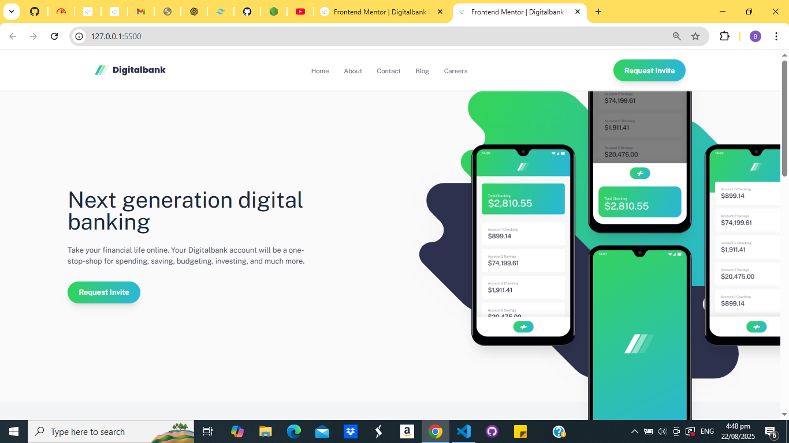 
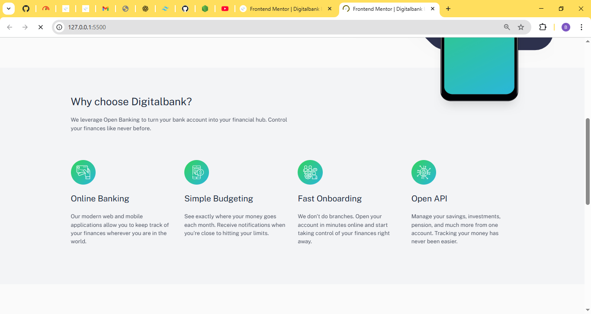
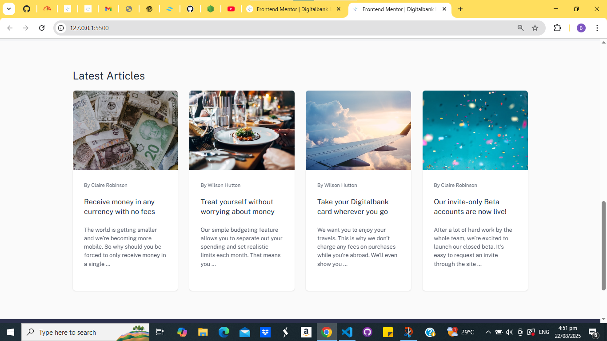
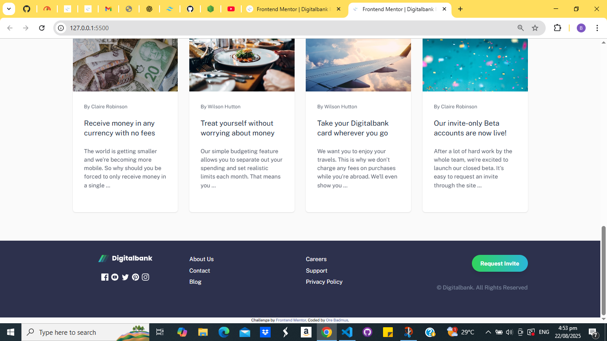 
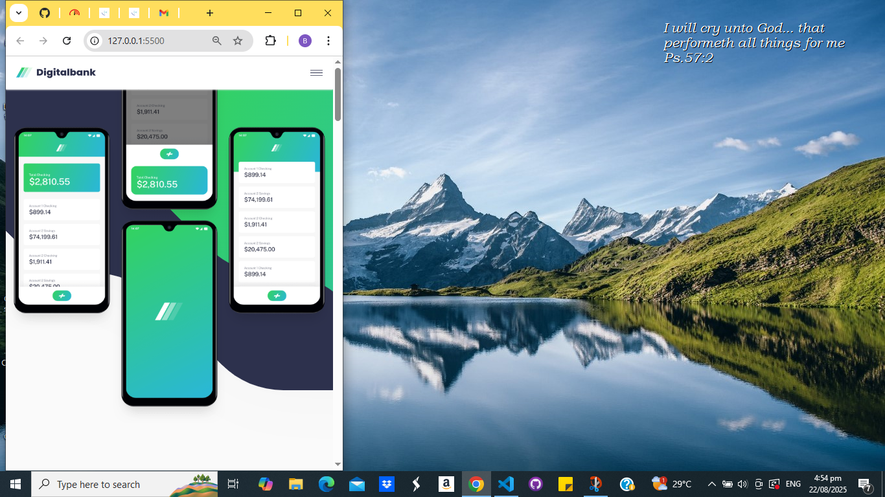 
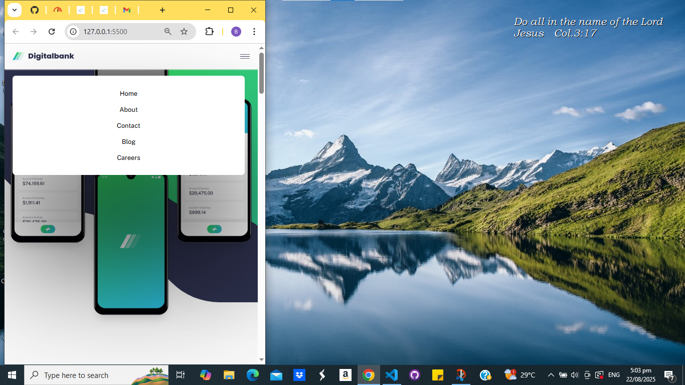 
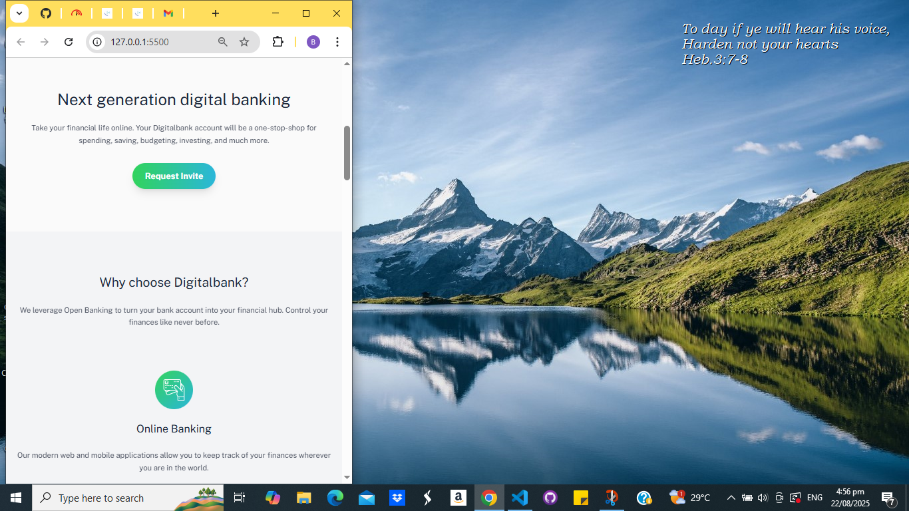
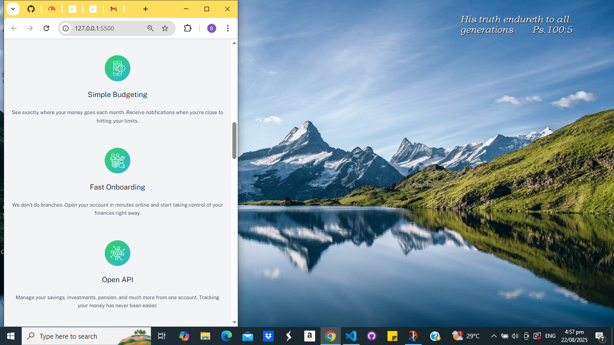 
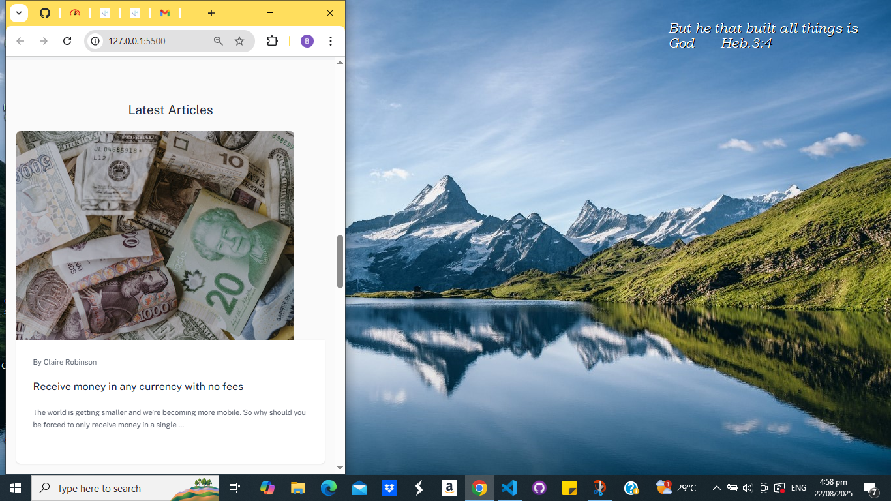 
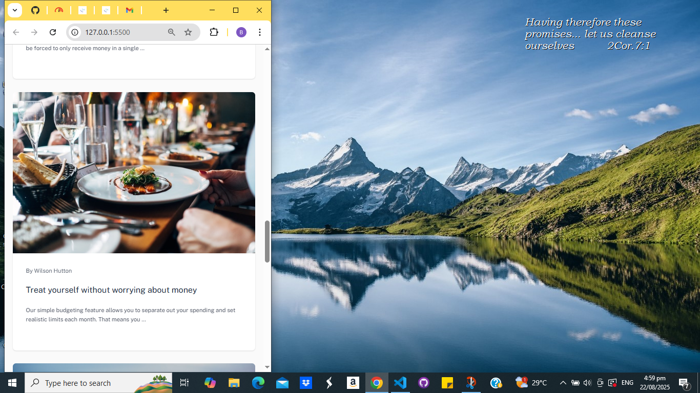 
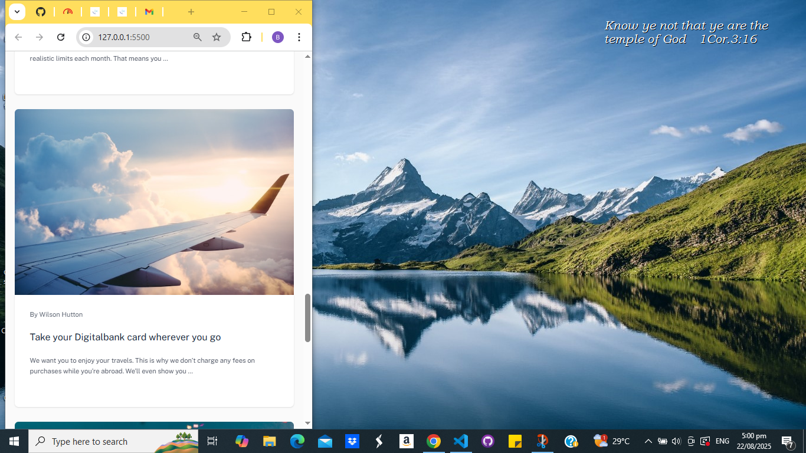 
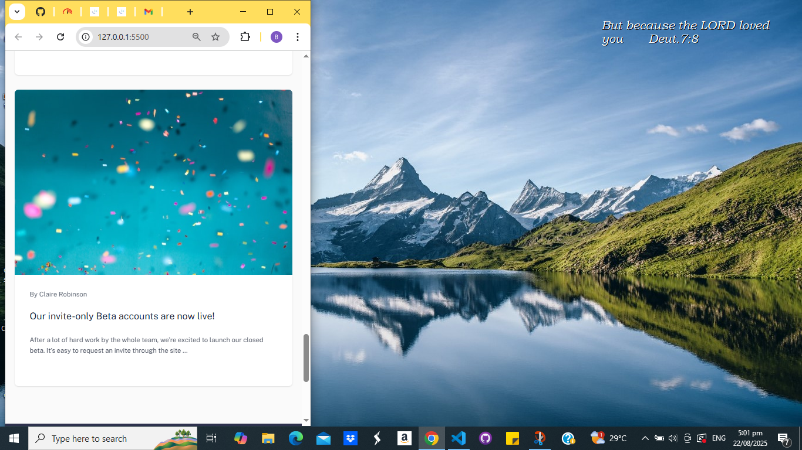 
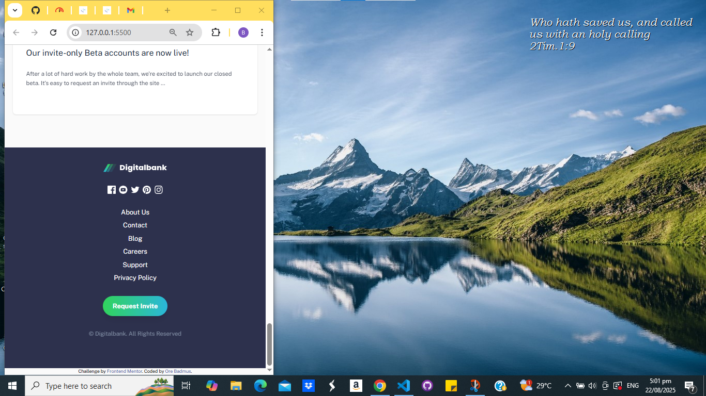 

### Links

- Solution URL: [My Solution URL](https://github.com/OreBadmus/digitalbank-landing-page.git)
- Live Site URL: [Live Site](https://orebadmus.github.io/digitalbank-landing-page/)

## My process

### Built with

- Semantic HTML5 markup
- Tailwind CSS
- Flexbox
- CSS Grid
- Mobile-first workflow
- Vanilla JavaScript (for mobile menu toggle)
- [Google Fonts](https://fonts.google.com/specimen/Public+Sans) - Public Sans

### What I learned

While building this landing page, I solidified my understanding of:

- Tailwind CSS utility classes for responsive layouts
- Creating mobile-first responsive components
- Managing layout shifts using Grid and Flexbox
- Implementing a mobile hamburger menu using basic JavaScript
- Writing clean and scalable utility-first styles

Here’s a simple snippet I’m proud of, which toggles the mobile menu:

```js
const menuBtn = document.getElementById('menu-button');
const nav = document.getElementById('nav-menu');

menuBtn.addEventListener('click', () => {
  nav.classList.toggle('open');
});
```
This provided a clean, unobtrusive way to manage the mobile nav state with Tailwind’s utility classes.

### Continued development

In future projects, I plan to:

- Integrate more accessibility features (ARIA labels, focus states)
- Explore component-based design with Tailwind and frameworks like React or Vue
- Optimize performance for image-heavy pages
- Improve JS structure with reusable functions or modules

### Useful resources

 - Tailwind CSS Docs
   The official documentation was extremely helpful in understanding layout utilities and responsive breakpoints.

 - Kevin Powell on YouTube
   His videos on layout and responsive design were invaluable.

 - CSS Tricks
   For quickly referencing Flexbox concepts.

## Author

 - Website - Ore Badmus

 - Frontend Mentor - @OreBadmus
 
 - Twitter - @orebadmus

## Acknowledgments

Thanks to the Frontend Mentor community for inspiration and feedback. Special shout-out to the creators of Tailwind CSS for such a powerful, intuitive framework. I also appreciate the thoughtful challenge design by the Frontend Mentor team — this was a fun and educational build.